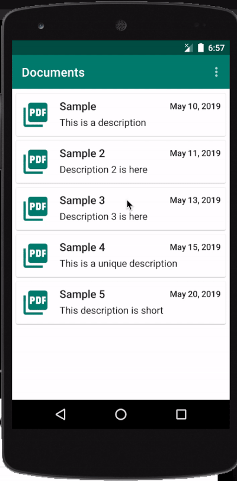

# Recruitment Project

## Architecture
Project architecture follows the principles of Clean Architecture. 
Benefits of using the "clean" approach:
* Modularisation - faster build times thanks to incremental builds
* Code is independent of frameworks (loose coupling between modules thanks to separate models + communication through interfaces)
* Code can be easily swapped in and out (for example to test a different database implementation)
* It's a pleasure to write tests (you can check few test examples in data, domain and ui modules)

## User Interface (app module)
This layer uses Android Framework to create all of the UI components. It receives data from the presentation layer and then maps it using an appropriate mapper.

### Languages, libraries, and tools used (the most important that should be mentioned)
* [Koin](https://github.com/InsertKoinIO/koin) - dependency injection for smaller projects (it is easier to setup than dagger but doesn't provide a compile-time validation and therefore should be used with caution)
* [Navigation component](https://developer.android.com/guide/navigation) - for generating navigation graph and easy screen to screen navigation 
* [ConstraintLayout](https://developer.android.com/training/constraint-layout) - for constructing complex xml layouts with ease
* [Adapter delegates](https://github.com/sockeqwe/AdapterDelegates) - delegate pattern for android adapters. Thanks to this our list screen is more extensible
* [PdfPreview](https://github.com/voghDev/PdfViewPager) - widget for displaying pdf files within a viewpager
* [Coroutines](https://kotlinlang.org/docs/reference/coroutines-overview.html) - a flexible approach for handling asynchronous operations (less boilerplate code than rxjava)

## Presentation
This layer uses the MVVM approach to orchestrate communication between UI and data modules. ViewModel communicates with data through the use cases, maps retrieved data and then exposes it with immutable UI state class. This UI state class is called Resource and has three subclasses (Loading, Success, Error). There are two View Models present in this module:
- DocumentPreviewViewModel for orchestrating actions/states on document preview screen (displaying loading state, fetching, handling errors, etc) 
- DocumentsViewModel for orchestrating action/states on documents list screen (fetching documents, sorting, etc)
### Languages, libraries, and tools used
* [View Model](https://developer.android.com/topic/libraries/architecture/viewmodel?gclid=Cj0KCQjw9JzoBRDjARIsAGcdIDUibAyk0jvZfpbFNk149oDV9RWDp0w_XWY4s4P29tIft0_yrFArO6oaAsCtEALw_wcB) - ViewModels are restored after configuration changes (language change, rotation, keyboard availability, multi-window mode turned on) and can be used to provide chunks of data to the next instance of Activity and/or View hierarchy of fragment that is coming from back stack.     
* [Live Data](https://developer.android.com/topic/libraries/architecture/livedata) - LiveData is a lifecycle-aware observable and thanks to that we don't have to manually remove observers (from Activity/Fragment) and we can be sure that the data from it won't be passed to components with a state other than Started/Resumed.

## Domain
Domain layer contain various UseCases used in our app. These use cases retrieve data from data modules through the interfaces (DocumentsRepository in our case) and pass it into the Presentation Layer. Our app defines three use cases:
- GetDocumentsListUseCase for fetching documents 
- GetDocumentFileUseCase for fetching pdf files 
- SortDocumentsUseCase for sorting documents with chosen sort order 
### Languages, libraries, and tools used
* Pure kotlin module

## Data
Access point for getting data from the correct data source (Cache/Remote/File storage). It contains the implementation of DocumentsRepository (defined in the domain module). This implementation fetches documents from remote and saves them to cache if it's a first app launch (otherwise it will retrieve them from the cache without remote access).
DocumentsRepository is also responsible for providing communication between local/remote sources and file storage to fetch document pdf file.
### Languages, libraries, and tools used
* Pure kotlin module

## Remote
This module handles the communication with remote sources (in our cases it is a simple API call to fetch document pdf by using Retrofit interface). It also provides a documents list that was defined for the recruitment task.
### Languages, libraries, and tools used
* [Retrofit](https://square.github.io/retrofit/) - current standard network communication
* [OkHttp](https://github.com/square/okhttp) - An HTTP & HTTP/2 client for Android and Java applications
* [Joda time](https://www.joda.org/joda-time/) - For parsing document dates

## Cache
Cache module communicates with the local database (Room) which is used to cache documents
### Languages, libraries, and tools used
* [Room](https://developer.android.com/training/data-storage/room) - easy to use library that abstracts sqlite implementation
